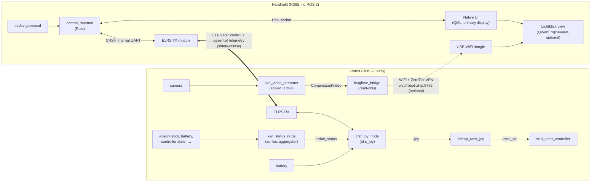
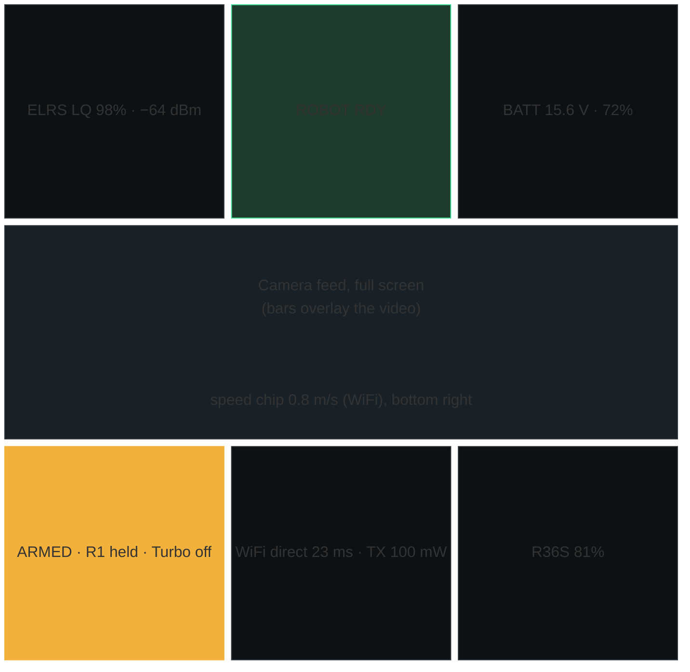
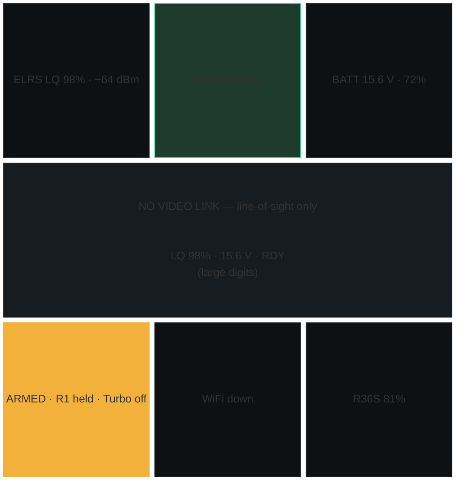
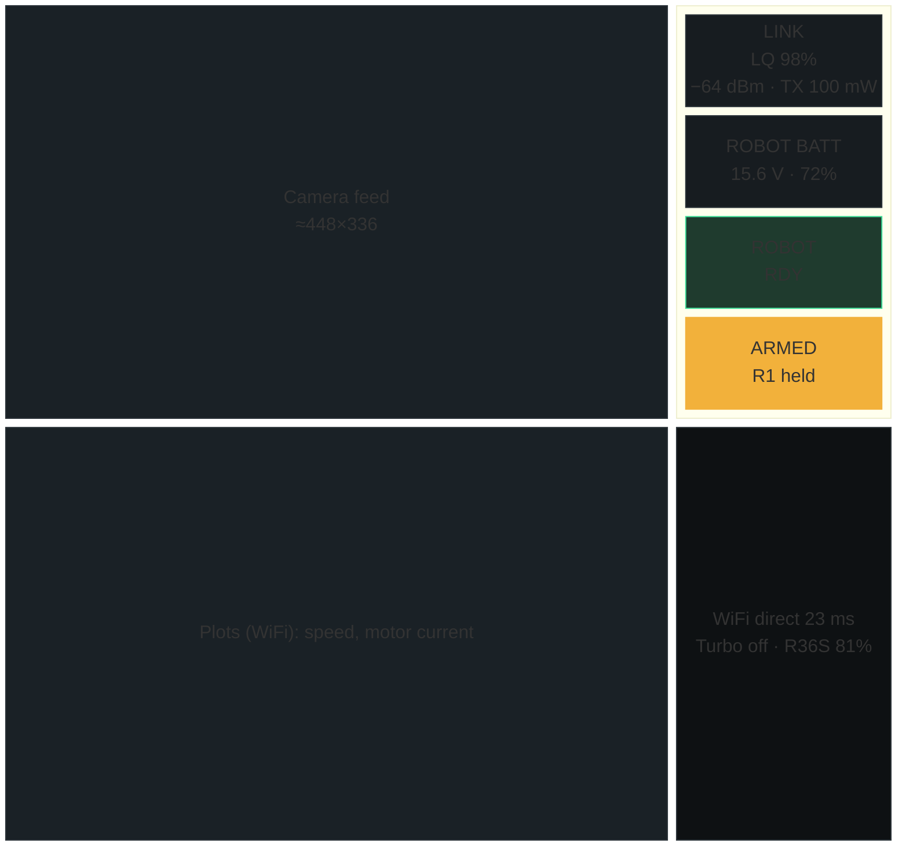
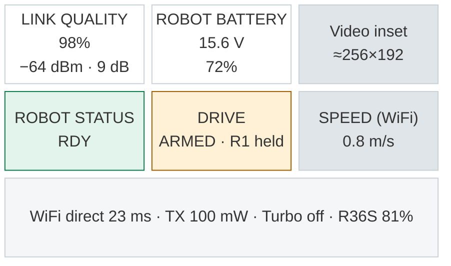
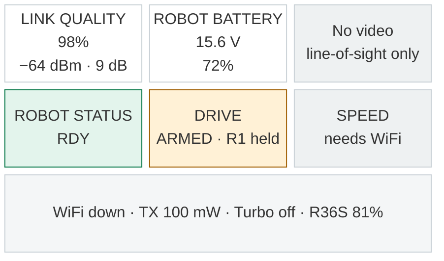
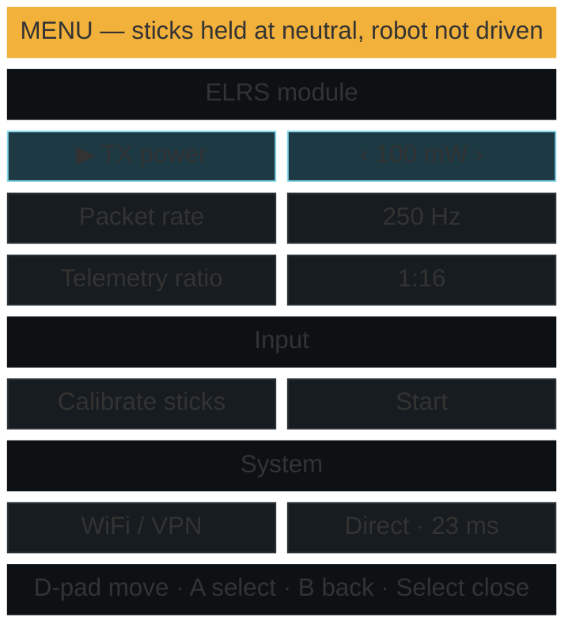
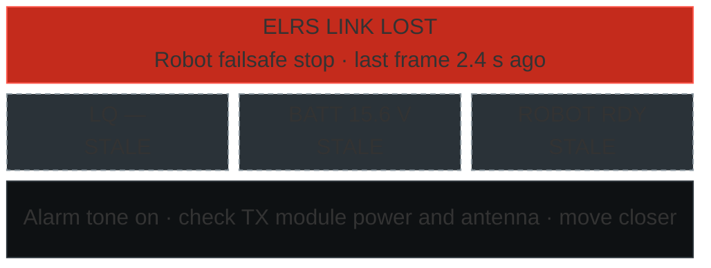

# Remote Controller — Design

A handheld ground station for the KVN rover, built on an R36S (RK3326) handheld. The rover is driven over ExpressLRS (ELRS). Video and rich telemetry are added over WiFi through `foxglove_bridge` running on the robot, viewed in Lichtblick on the handheld.

## 1. Guiding Principle: Link Criticality

**ELRS is the safety-critical, reliable link. WiFi is optional.** The system must be fully operational, in a degraded mode, with no WiFi at all.

| | ELRS (CRSF) | WiFi (via ZeroTier VPN) |
|---|---|---|
| Role | Control, safety, essential telemetry | Video, rich telemetry, visualization |
| Required to operate | Yes | No |
| Carries control | Always, exclusively | Never, not even as fallback |
| On loss | Robot failsafe stop (existing 300 ms timeout) | No change to robot behavior; handheld shows a quiet indicator |

Rules derived from this:

1. **R1 — Control only over ELRS.** Driving, arm/disarm, and stop commands travel only over CRSF. No WiFi path can command motion: `foxglove_bridge` runs with client publish, services, and parameters disabled.
2. **R2 — WiFi loss never changes robot behavior.** ELRS loss always triggers failsafe, even if WiFi is up.
3. **R3 — The handheld boots and runs with no network.** The control daemon and native UI never wait on WiFi or the VPN. ELRS module configuration is local (CRSF), not network-dependent.
4. **R4 — Processes are isolated by criticality.** A crash in a less critical process never affects a more critical one (see §3).
5. **R5 — On the robot, the control path has priority over optional load.** Video encoding and `foxglove_bridge` must not starve the CRSF → `/joy` → teleop → motor chain.
6. **R6 — Essential telemetry arrives over ELRS.** Link quality, robot battery, and robot status are always displayed, independent of WiFi.

## 2. System Overview

The solid thick link is required; the dotted link is optional and never carries control.

## 3. Handheld Components

The handheld runs three processes, listed from most to least critical. Each one depends only on the processes above it.

### 3.1 `control_daemon` (critical, no ROS 2)

A Rust process; it is the only process that owns the gamepad and the ELRS module.

* **Input**: Opens the R36S gamepad via `evdev` with `EVIOCGRAB` (exclusive). It is the single owner of physical input and forwards menu navigation events to the UI over IPC (§3.4).
* **TX loop**: A dedicated thread, `SCHED_FIFO`, timer-driven. Each tick samples the latest input state, applies the mapping (§5.1) and the arm/deadman logic (§6), then sends `RC_CHANNELS_PACKED` (0x16). The send period follows the module's timing frames (`OPENTX_SYNC`, 0x10) so frames stay in step with the ELRS packet rate. Input events update shared state only; they never drive frame timing.
* **Telemetry RX**: Parses `LINK_STATISTICS` (0x14), `BATTERY_SENSOR` (0x08), and `FLIGHT_MODE` (0x21, robot status string) and keeps a timestamped telemetry model.
* **Module configuration**: Implements the CRSF parameter protocol (`DEVICE_PING` 0x28, `DEVICE_INFO` 0x29, `PARAMETER_SETTINGS_ENTRY` 0x2B, `PARAMETER_READ` 0x2C, `PARAMETER_WRITE` 0x2D). This is the protocol the ELRS Lua script uses to change TX power, packet rate, and telemetry ratio.
* **Protocol code**: Reuses `elrs_joy_crsf_protocol` from [deps/elrs_joy](deps/elrs_joy/README.md), a C++20 library with no ROS dependencies, through Rust bindings (§3.5), so the handheld and robot share one CRSF implementation.
* **Crates**: `evdev` (input, with grab), `serialport` (internal UART, full duplex, standard baud rate), and `nix`/`libc` (`SCHED_FIFO`, `mlockall`). It uses plain threads, no async runtime.
* **Independence**: Runs and keeps the link up with no UI connected. If the UI dies, control continues.

### 3.2 Native UI (Qt, primary display)

A fullscreen Qt 6 **QML** application at 640x480 on `eglfs`. It is the **primary** display and works with no WiFi.

* **Implementation**: QML holds the UI. A thin C++ host provides the IPC client and exposes the telemetry model to QML; the UI logic is small, so Rust bindings (`cxx-qt`) would add build complexity for little gain. QML is chosen over Qt Widgets because it supports gamepad focus navigation (`FocusScope`, `KeyNavigation`) and an in-scene `WebEngineView`.
* **Fallback**: If the Phase 1 spike drops Lichtblick, Slint (Rust, renders directly on KMS/DRM) replaces Qt, making the handheld pure Rust.

* **Always-on status bar**:
  * ELRS LQ/RSSI/SNR and TX power
  * robot battery
  * robot status string
  * arm state
  * input mode
  * WiFi/VPN state
* **Alarms**:
  * ELRS degraded/lost: loud (full-screen banner, sound).
  * Telemetry stale (age-based): visible.
  * WiFi/VPN lost or relayed: quiet, informational only.
* **Menu overlay** (toggled with Select): ELRS module settings (TX power, packet rate, telemetry ratio), input calibration, and system information. Navigated with the D-pad, A, and B buttons; the R36S has no touchscreen, so every widget must be reachable with the gamepad.
* **Lichtblick host**: Embeds the Lichtblick view (§3.3) as the background of the main screen when the robot is reachable. Otherwise it shows a native "no video link" panel. The status bar is always drawn natively, on top of the view.

#### 3.2.1 Screen Layout Options (to choose, plan T0.7)

All options show the same data and follow the same rules:
* ELRS data (link, battery, status, arm state) is drawn natively and never depends on WiFi.
* Alarms override everything.
* Only the WiFi-fed areas (video, plots) change between full and degraded mode.

The options differ in how much of the 640x480 screen goes to video, and in how the screen changes when WiFi drops. The wireframes show proportions, not exact sizes; the values are sample data.

##### Option A — Video HUD

Full-screen video, with thin translucent bars at the top and bottom, like an FPV display.

No WiFi: the video area becomes a large-format repeat of the essential telemetry.

* **Pros**:
  * the most video area
  * a familiar FPV look
* **Cons**:
  * text drawn over video is harder to read in sunlight
  * no room for Lichtblick plots, except small overlays
  * the screen changes the most when WiFi drops

##### Option B — Instrument Split

The video (4:3, about 448x336) is on the left, with a fixed instrument column on the right and a strip for WiFi-fed plots along the bottom.

No WiFi: the instrument column is unchanged, and only the video and plot panes switch to placeholders.

* **Pros**:
  * essential telemetry stays in the same place in every mode, which matches R6 best
  * no text over video
  * room for Lichtblick plots
* **Cons**:
  * smaller video (about 70% of the width)
  * more layout work in QML

##### Option C — Sunlight Tiles

A light, high-contrast theme for outdoor use. Telemetry tiles come first, and the video is an inset.

No WiFi: only the inset and the WiFi tile change.

* **Pros**:
  * the most readable outdoors
  * almost no change when WiFi drops
  * the lowest decode and render load, because the video is small
* **Cons**:
  * the video is too small to drive by camera
  * plots get little space

##### Recommendation

**Option B.** Essential telemetry keeps the same position in every mode (R6), the video is still large enough to drive by, and nothing is drawn over it. Choose A if the robot is mostly driven by camera, or C if it is mostly driven line-of-sight outdoors. A light/dark theme switch (C's palette applied to A or B) can be added in any option.

##### Shared States

These are the same in every option; they take the chosen option's colors.

**Menu overlay** (opened with Select). Sticks are forced to neutral and the robot is not driven (§6):

**ELRS link lost.** A full-screen alarm with a tone; the last known values are shown and marked stale:

### 3.3 Lichtblick View (optional)

* A `QWebEngineView` loads a locally hosted static Lichtblick build. It connects to `ws://<robot-zt-ip>:8765` using URL parameters and loads a fixed, minimal layout: a video panel plus a few plots.
* It runs in a separate process (a QtWebEngine renderer, or a separate helper process if needed). It may crash, hang, or reconnect without affecting the daemon or the native status bar; the native UI restarts it.
* It is started only when the robot's bridge is reachable, to save RAM and CPU otherwise.
* No `QWebChannel` bridge in v1.

### 3.4 Daemon ↔ UI IPC

A Unix domain socket carrying length-prefixed messages:

* **daemon → UI**:
  * telemetry snapshot at 10 Hz
  * alarms (sent as events)
  * menu input events while the menu is open
  * module parameter tree
* **UI → daemon**: requests, such as reading or writing a module parameter or setting an override. Each request gets an acknowledgement.

The daemon treats the UI as untrusted for safety purposes: no UI request can arm the robot or command motion directly (§6).

Because the daemon and UI meet only at this socket, each can be written in a different language.

### 3.5 CRSF Rust Bindings

The handheld uses the robot's C++ CRSF library through two crates:

* **`elrs_crsf_sys`**:
  * A thin C++ facade (`crsf_ffi.hpp/.cpp`, about 100–200 lines) exposing a flat API that the `cxx` crate can bind.
  * Its `build.rs` compiles the library's `src/crsf/*.cpp` and the facade with `cxx-build`. It does not use the library's ament-based CMake.
* **`elrs_crsf`**: Safe Rust wrappers and types, used by the daemon.

The facade exists because the library's API uses `std::optional`, `std::span`, templates, and a `std::function` frame callback, none of which `cxx` binds directly. The facade translates them:

* The callback becomes a poll: `parser_feed(bytes)` queues decoded frames and `parser_next(&mut out)` returns them one at a time.
* Shared plain structs (`LinkStats`, `Battery`, `FlightMode`, `ParamEntry`, …) replace `std::optional<Payload>`.
* `rust::Slice`/`rust::Vec` replace `std::vector`/`std::span`.

Design consequences:

* **Library changes needed for the handset role** (made in the C++ library, so both sides get them):
  * Accept sync/address `0xEA` (radio transmitter) in `Packets::VALID_SYNC_BYTES`.
  * Add an `OPENTX_SYNC` (0x10) payload and message.
  * Confirm that chunked `PARAMETER_SETTINGS_ENTRY` covers the ELRS Lua parameter protocol.
  * RC frames to the module are sent with address `0xEE` via the existing `to_frame(sync)`.
* **Safety boundary**: The C++ parser handles raw serial input inside the safety-critical process, outside Rust's guarantees. This is mitigated by:
  * fuzzing the facade with `cargo fuzz`;
  * keeping the existing C++ tests (`test_crsf_frame.cpp`) authoritative;
  * adding golden-frame fixtures that run in both test suites.
* **Toolchain**: Cross-compiling requires an aarch64 C++20 compiler, set through `CXX_aarch64_unknown_linux_gnu`, alongside the Rust target.

## 4. Robot Components

The robot-side packages (`kvn_status`, `kvn_video_streamer`, `kvn_robot_bringup`) live in the [kvn-robot](https://github.com/AlessioMorale/kvn-robot) repository.

* **`crsf_joy_node`** (existing, `elrs_joy`): CRSF → `/joy` with failsafe. Extended to send a **robot status string** over `FLIGHT_MODE` (0x21) in addition to battery. It subscribes to the status node's string topic and forwards it as-is at about 2 Hz; it has no knowledge of what the status means.
* **Status node** (new, ad-hoc; working name `kvn_status_node`): collects robot health from several sources and reduces it to one short status string for ELRS.
  * **Inputs**:
    * `/diagnostics` (including the existing `ros_hwmon_diagnostic_updater`)
    * battery state
    * controller state
    * teleop enable (AUX1 via `/joy`)
    * other sources added as needed
  * **Output**:
    * `/robot_status` (`std_msgs/String`), published at 2 Hz and immediately on change.
    * Optionally, a richer structured topic for Lichtblick.
  * **Format**: `<STATE>[:<CODE>]`, ASCII, at most 15 characters. STATE is one of `FLT`, `WRN`, `DRV`, `RDY`; for example `FLT:MOTOR_L`, `WRN:TEMP`, `RDY`.
  * **Priority**: the highest severity wins (FAULT > WARN > operating state). If several faults are active, it reports the most severe; ties go to the oldest.
  * **Staleness**: an input that stops updating within its timeout is reported as a fault, so a dead sensor never shows as `RDY`.
* **`foxglove_bridge`** (existing `kvn_foxglove_bridge.launch.py`, hardened):
  * `capabilities` reduced to what read-only viewing needs. No `clientPublish`, `services`, `parameters`, or `parametersSubscribe`.
  * `topic_whitelist` limited to the layout's topics.
  * A bounded `send_buffer_limit`.
* **Video streamer** (new; working name `kvn_video_streamer`): publishes scaled, frame-rate-reduced H.264 as `foxglove_msgs/CompressedVideo` (`format: "h264"`), which Lichtblick plays natively.
  * Optional WebRTC branch (`webrtcsink`, gst-plugins-rs) for the handheld's native video view, independent of Lichtblick: congestion control and loss recovery over UDP; the Foxglove path stays as is. See `docs/results.md`, "WebRTC spike".
  * **Pipeline**: camera frames → scale to the handheld's display (baseline 640x480 or lower) → drop frames to the target rate (baseline 15 fps) → H.264 encode.
  * **Encoder**: hardware encoder on the robot's SoC if available. Otherwise software with low-latency settings (x264 `ultrafast`/`zerolatency`).
  * **Stream constraints**:
    * Annex B byte stream, as Lichtblick expects.
    * No B-frames, for low latency and to suit Lichtblick's decoder.
    * Keyframe interval ≤ 1 s, so a viewer that reconnects after a WiFi drop resumes quickly.
    * Capped bitrate (baseline 1–2 Mbps), configurable.
  * **On demand**: encodes only while the topic has subscribers. `foxglove_bridge` subscribes only while a client is viewing, so no CPU is spent when the handheld is not connected.
  * **Priority**: lower than the control path (R5).
* **CPU priority (R5)**: The control chain (`crsf_joy_node`, `teleop_twist_joy`, `controller_manager`) runs at normal or elevated priority. `foxglove_bridge` and video run at a lower priority (systemd `Nice=` and `CPUQuota=`).
* **DDS scope**: ROS 2 traffic stays on the robot (`ROS_AUTOMATIC_DISCOVERY_RANGE=LOCALHOST`). DDS is never carried over the VPN. Only the bridge's WebSocket is exposed.

## 5. Interfaces

### 5.1 CRSF Channel Contract

The handset must match the robot's existing configuration in `teleop.yaml` (AETR order, mode 2):

| CRSF ch | Name | Robot use | R36S source |
|---|---|---|---|
| 0 | Aileron | yaw (`axis_angular.yaw: 0`) | Right stick X |
| 1 | Elevator | linear x (`axis_linear.x: 1`) | Right stick Y |
| 2 | Throttle | unused | Left stick Y (self-centering → 0) |
| 3 | Rudder | unused | Left stick X |
| 4 | AUX1 | `buttons[0]` = teleop enable | Arm latch && deadman held (§6) |
| 5 | AUX2 | `buttons[1]` = turbo (per yaml header) | Toggle (e.g. R2) |
| 6–7 | AUX3–4 | spare | — |

The robot config is consistent with this table: `enable_button: 0` (AUX1) and `enable_turbo_button: 1` (AUX2) in `teleop.yaml` (plan T0.1). The turbo toggle is AUX2, a latching state of the handset, high = turbo; it is reset to normal on disarm.

### 5.2 ELRS Telemetry Budget

The ELRS telemetry ratio and packet rate are chosen so that, in addition to `LINK_STATISTICS`, the downlink fits:

* battery at ≥ 1 Hz
* status at ≥ 2 Hz

The actual achieved rate is verified on hardware (plan A4).

### 5.3 WiFi / VPN

* Robot and handheld are members of a ZeroTier network with static managed IPs. The Lichtblick URL uses the robot's ZeroTier IP.
* Robot firewall (nftables): port 8765 is accepted only on the ZeroTier interface. ZeroTier flow rules may further restrict access to the handheld and dev machines.
* ZeroTier may fail to come up without internet access, or may fall back to a relayed path. Both cases are **degraded mode**, not failures.
* The native UI shows the VPN path state (direct or relayed), because a relayed path makes video unusable.

## 6. Safety

* **Startup**: The daemon sends frames only after it has confirmed that the sticks are neutral, and it always starts **disarmed** (AUX1 low).
* **Arm/deadman**: AUX1 is high only while the system is **armed** *and* the **deadman** button (R1) is held.
  * Arming: hold L1 and R1 for 1 s with the sticks neutral.
  * Disarming: a short L1+R1 press, or loss of the input device.
  * The robot's `require_enable_button: true` must be kept, so that `teleop_twist_joy` publishes motion only while AUX1 is high.
* **Menu open**: Axes are forced to neutral and AUX1 low while the menu overlay is open. The D-pad and buttons navigate the menu instead of driving.
* **Overrides** from the UI (e.g. a fixed axis value for testing):
  * allowed only when disarmed, or when bounded and time-limited (expiring if the UI stops refreshing them)
  * always shown in the status bar
  * cleared on disarm
* **Daemon crash**: The TX module stops receiving CRSF and stops sending to the robot, so the robot failsafe triggers after `failsafe_timeout_ms` (300 ms). systemd restarts the daemon, which comes back **disarmed**.
* **No motion over WiFi**: enforced by the bridge capability settings (R1). Lichtblick publish and teleop panels are not part of the layout.

## 7. Operating Modes

| Mode | ELRS | WiFi/VPN | Available | Indication |
|---|---|---|---|---|
| Full | OK | OK (direct) | Drive, essential telemetry, video, rich telemetry | — |
| Degraded | OK | Down or relayed | Drive, essential telemetry; **line-of-sight only** | Quiet WiFi indicator |
| Failsafe | Lost | any | Robot stopped by RX failsafe; handheld shows last-known state as stale | Loud alarm |
| Disarmed | OK | any | Telemetry, configuration; no motion | Status bar |

## 8. Security

* `foxglove_bridge` is never exposed outside the VPN (firewall rule), and it is read-only (capabilities).
* VPN membership is a trust boundary. It does not replace the read-only bridge configuration (defense in depth).
* ZeroTier membership is managed in ZeroTier Central by default. Self-hosting the controller on the robot is an option if third-party control of membership is unacceptable.

## 9. Platform Assumptions and Risks (R36S)

The R36S has an RK3326 SoC (4× Cortex-A35), 1 GB RAM, a Mali-G31 GPU, and a 640x480 3.5" display. It has no touchscreen and runs KMS/DRM with no X server, so Qt runs on `eglfs`.

**It has no built-in WiFi.** WiFi uses a USB dongle on the single USB OTG port. The ELRS TX module is wired to the internal UART instead, so the two do not compete for the port (§9.3).

### 9.1 OS Image Candidates

Two images are evaluated side by side in the Phase 1 spike; the choice is made on measured results.

| | **dArkOS** (R36S fork) | **Armbian** (community R36S build) |
|---|---|---|
| Source | [christianhaitian/dArkOS](https://github.com/christianhaitian/dArkOS); R36S forks: [southoz/dArkOSRE-R36](https://github.com/southoz/dArkOSRE-R36), [djparentx/dArkOSen-R36S](https://github.com/djparentx/dArkOSen-R36S) | [R36S-Stuff/R36S-Armbian](https://github.com/R36S-Stuff/R36S-Armbian): Armbian build framework with `userpatches` (not an official Armbian board) |
| Userspace | Debian 13 (trixie) | Debian 12 (bookworm), Ubuntu 22.04/24.04/25.04; trixie would need a new config |
| Kernel | Rockchip BSP **4.4** (`rg351` branch), PREEMPT_VOLUNTARY, HZ=250 | Mainline **6.12 LTS** (`linux-6.12.y-rk3326`), PREEMPT_VOLUNTARY, HZ=300 |
| GPU stack | Proprietary `libmali-bifrost-g31` (GBM) | Mesa **Panfrost** (standard upstream path) |
| Qt 6 / QtWebEngine | trixie `qt6-webengine` 6.8.2, built with proprietary codecs and system FFmpeg; Chromium runs on the libmali blob, an untested combination | Standard Mesa GL path for Chromium. Qt/WebEngine version depends on the base: bookworm and noble ship an older 6.4 |
| Hardware H.264 decode (native fallback) | Kernel MPP service present, but dArkOS builds MPP user space only for RK3566. We would have to build MPP and the GStreamer Rockchip plugin | Hantro VPU (`VIDEO_HANTRO_ROCKCHIP`) via V4L2 stateless decoding; GStreamer `v4l2codecs` works upstream |
| TUN / `uinput` | ✅ / ✅ | ✅ / ✅ |
| Internal UART for the TX module (§9.3) | Claimed by the Rockchip FIQ debugger (`ttyFIQ0`); must be released in the device tree | Plain 8250 UART (`ttyS2`); remove it as the console |
| USB WiFi drivers | Out-of-tree BSP drivers for common dongles | Mainline drivers (e.g. `mt7601u`, `rtl8xxxu`); pick a dongle with an upstream driver |
| Board/panel coverage | Broad: many R36S and clone board revisions, some in beta | Original R36S panels 0–4 via overlays; newer board revisions unverified |
| Maintenance | Active (upstream commits Sep 2026, R36S fork releases 2026) | One community maintainer, last release RC5 (Jul 2025) |
| Image style | Gaming distro (EmulationStation, emulators) that must be stripped | `minimal` headless image is a good appliance base; the build framework can bake our packages into a reproducible image |

**Leaning:** Armbian/mainline is the better technical fit: the standard Mesa GPU path for QtWebEngine, upstream video decoding, a plain UART that is easy to free, and a minimal, reproducible image. Its weakness is maintenance, so we would own a fork of the `userpatches` and add a trixie config. dArkOS is the fallback, with broader board coverage and active maintenance. Phase 1 decides.

### 9.2 Risks

| Risk | Impact | Mitigation |
|---|---|---|
| QtWebEngine + Lichtblick too heavy (RAM, startup, frame rate) | Lichtblick unusable | Phase 1 spike; fallback is a native Qt video and telemetry view |
| Chromium GPU process fails on the GPU stack (libmali blob on dArkOS; Panfrost performance on Armbian) | Software rendering; Lichtblick too slow | Check `chrome://gpu` in the spike on both images |
| QtWebEngine cannot decode H.264 | Lichtblick cannot play the video stream | Decode H.264 natively in the QML UI with GStreamer and hardware decoding (Hantro V4L2 on mainline; MPP on BSP), subscribing through a small native Foxglove WebSocket client; Lichtblick keeps the plots only |
| Community R36S image unmaintained | No fixes or updates | Own the image build (fork the userpatches or dArkOS scripts); pin versions |
| Board revision or panel not supported by the chosen image | Device does not boot or shows no display | Identify the board revision and panel first (Phase 0) |
| Internal UART still used as the boot/kernel console | Boot messages and a login prompt are sent to the TX module | Free the UART (§9.3); the daemon's parser discards non-CRSF bytes and sends nothing until it is running |
| TX module current draw (RF output up to ~1 W) | Brownouts, or the handheld's battery drains quickly | Check the R36S 5 V rail capacity; limit TX power or use a separate supply |
| ZeroTier CPU cost on A35 | Lower video frame rate | Lower bitrate or resolution; measure in spike |

### 9.3 Handheld Hardware Integration

* **TX module wiring**: The R36S internal UART pads (TX, RX, GND; the debug UART, UART2) connect to the TX module's CRSF UART at 3.3 V TTL, full duplex, at the baud rate in §11.
* **Freeing the UART**: The UART must be released from its debug role, or boot output and a login prompt will reach the TX module.
  * Remove it as the kernel console (`console=`/`earlycon` on the kernel command line) and as U-Boot's console where possible.
  * Disable the serial getty on it.
  * On the BSP kernel (dArkOS), also disable the `fiq-debugger` node in the device tree so the UART appears as a normal `ttyS2`.
  * Even so, U-Boot output before Linux starts may reach the module. This is harmless, because the daemon sends nothing until it is running and the module ignores non-CRSF input. Confirm it on hardware.
* **Device naming**: A udev rule creates a stable symlink, `/dev/elrs_tx`, used in the daemon's config.
* **Power**: The TX module is powered from the handheld's 5 V rail or a separate supply, depending on its current draw at the configured RF power (§9.2).
* **WiFi**: A USB dongle on the OTG port. Choose a dongle whose driver is upstream (e.g. `mt7601u`, `rtl8xxxu`), which matters especially on the mainline kernel.

## 10. Trade-offs

* **Lichtblick vs native Qt for rich telemetry**: Lichtblick gives pre-built panels (video, plots, 3D) for little code, but has a high resource cost on the handheld. Because the native UI is the primary display anyway, Lichtblick can be dropped without losing any essential function.
* **H.264 over JPEG for video** (decided): H.264 uses much less WiFi bandwidth and handheld CPU per frame. The cost is a dependency on H.264 decoding on the handheld (§9) and a short wait for the next keyframe after reconnecting.
* **Language split**:
  * **Daemon in Rust**: memory safety and an explicit state machine for the safety-critical process.
  * **CRSF through `cxx` bindings rather than a Rust rewrite**: one implementation shared with the robot. The cost is a C++ parser inside the Rust process (mitigated in §3.5).
  * **UI in QML with a thin C++ host**: the standard Qt path with the least cross-compilation friction.
* **ZeroTier vs WireGuard**: ZeroTier gives easy membership, NAT traversal, and remote access. WireGuard works fully offline and costs less CPU. Because WiFi is optional (R2, R3), ZeroTier's dependency on its servers is acceptable.

## 11. Decisions and Open Questions

**Decided**

* **TX module**: An ELRS TX module wired to the R36S **internal UART** (3.3 V TTL), **full duplex**. No half-duplex handling and no USB-serial chip are needed (§9.3).
* **Baud rate**: Configurable at both ends. Use a standard Linux rate (baseline 921600, well above CRSF needs at the planned packet rates), so no custom-baud (`termios2`) code is needed.
* **WiFi**: A USB dongle on the R36S USB port, which is now dedicated to WiFi.
* **Video**: A new robot-side streamer that sends scaled, frame-rate-reduced H.264 (§4). The whole camera chain (camera, driver, encoder) is under our control, so its parameters are chosen to fit the handheld rather than discovered.
* **Status string**: Produced by a new ad-hoc status node that aggregates diagnostics and other sources (§4).

**Open**

1. **OS image for the R36S**: Armbian (mainline, leaning) or dArkOS (fallback), decided by the Phase 1 spike (§9.1). Requirements:
   * Qt 6 with QtWebEngine and QML on `eglfs`, with GPU acceleration
   * a kernel with TUN
   * cross-compilation support: a sysroot for Rust plus C++20
   * H.264 decoding in QtWebEngine, or hardware decoding for the native fallback
   * the internal UART free for user space (§9.3)
2. The R36S board revision and panel, which determine which OS images can boot (§9.1).

## 12. References

* Lichtblick: https://github.com/lichtblick-suite/lichtblick
* foxglove_bridge: https://index.ros.org/p/foxglove_bridge/
* CRSF spec: https://github.com/tbs-fpv/tbs-crsf-spec/blob/main/crsf.md
* cxx (Rust ↔ C++ bindings): https://cxx.rs/
* ExpressLRS: https://www.expresslrs.org/
* ZeroTier: https://docs.zerotier.com/
