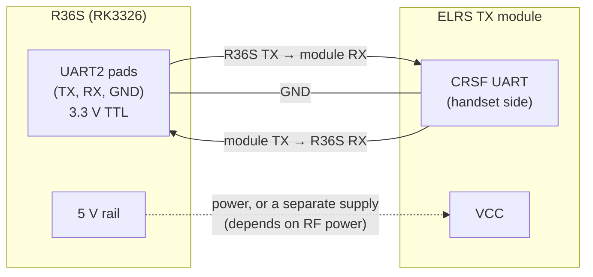

# Hardware record

Everything below is **empty until it is measured on the device**: it is the record for plan
tasks T0.2, T0.3, T0.5, T0.6 and T1.4. Nothing here has been filled in with guesses.

## TX module wiring (T0.2)

To record:

| Item | Value |
|---|---|
| UART2 pad locations | _photo_ |
| TX module model | |
| TX module firmware version | |
| Module handset baud rate (set to 921600) | |
| Power source and minimum supply voltage at maximum planned RF power | |
| Continuity check TX→RX, RX→TX, GND | |

The device-side free-up of the UART (kernel console, getty, FIQ debugger) is in
[Freeing the UART](#freeing-the-uart-t13) below.

## Robot camera chain (T0.3)

| Item | Value |
|---|---|
| Camera | |
| Driver / native modes | |
| Encoder (hardware or x264) | |
| Encoder CPU use at 640x480, 15 fps, no B-frames, 1 s GOP | |
| Reasoning | |

The streamer (`kvn_video_streamer`) takes the camera as a GStreamer source string and the
encoder as a parameter, so this choice is configuration, not code.

## OS image in use

The handheld runs the (d)ArkOS image with the [arkos4clone](https://github.com/lcdyk0517/arkos4clone/tree/main/rootfs) rootfs overlay (`rootfs/ArkOS` or `rootfs/dArkOS`), which adds support for R36S clone boards on the 4.4 BSP kernel. Not Armbian. Fill in on the device:

| Item | Value |
|---|---|
| Overlay variant (ArkOS or dArkOS) | |
| `/etc/os-release` | |
| `uname -r` | |
| glibc (`ldd --version`) | |
| GStreamer (`gst-inspect-1.0 --version`) | |
| Qt (`qmake6 -v` or `ls /usr/lib/*/libQt6Core.so*`) | |
| GPU / display stack (libmali? KMSDRM, eglfs?) | |
| Gamepad layout setting (XBOX or Nintendo) | |
| Hardware H.264 decode available (`gst-inspect-1.0 | grep -i -E "mpp|v4l2"`) | |

The overlay also installs EmulationStation, `351mp`, `batteryplus` and `es-status-daemon` services and a `99-odroidgo3.rules` udev rule; the provisioning must disable the gaming services (`image/darkos/provision.sh`).

## Board revision and panel (T0.5)

| Item | Value |
|---|---|
| Board silkscreen | _photo_ |
| Panel ID | |
| Armbian support | |
| dArkOS support | |

## WiFi dongle (T0.6)

| Item | Value |
|---|---|
| Model / chipset | |
| In-tree driver, Armbian kernel (6.12) | |
| In-tree driver, dArkOS kernel (4.4) | |

## Network (T1.4)

| Item | Value |
|---|---|
| ZeroTier network id | |
| Robot ZeroTier IP | |
| Handheld ZeroTier IP | |

## Freeing the UART (T1.3)

Needed so no boot message or login prompt reaches the TX module (design §9.3):

| Image | Steps |
|---|---|
| Armbian (mainline) | remove `console=ttyS2,...` and `earlycon` from the kernel arguments; `systemctl mask serial-getty@ttyS2.service`; udev rule `systemd/99-elrs-tx.rules` |
| dArkOS (BSP 4.4) | disable the `fiq-debugger` node in the device tree so the UART becomes `ttyS2`; remove the console argument; mask `serial-getty@ttyFIQ0.service` |

Verify: `ls -l /dev/elrs_tx` resolves to UART2; `stty -F /dev/elrs_tx 921600` works; after 5
reboots with the module attached its configuration is unchanged.
