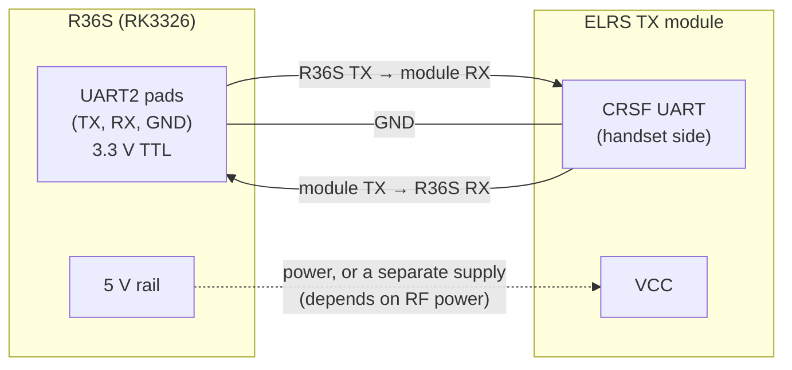

# Hardware record

Everything below is **empty until it is measured on the device**: it is the record for plan
tasks T0.2, T0.3, T0.5, T0.6 and T1.4. Nothing here has been filled in with guesses.

## TX module wiring (T0.2)

To record:

| Item | Value |
|---|---|
| UART2 pad locations | _photo_ |
| TX module model | |
| TX module firmware version | |
| Module handset baud rate (set to 921600) | |
| Power source and minimum supply voltage at maximum planned RF power | |
| Continuity check TX→RX, RX→TX, GND | |

The device-side free-up of the UART (kernel console, getty, FIQ debugger) is in
[Freeing the UART](#freeing-the-uart-t13) below.

## Robot camera chain (T0.3)

| Item | Value |
|---|---|
| Camera | |
| Driver / native modes | |
| Encoder (hardware or x264) | |
| Encoder CPU use at 640x480, 15 fps, no B-frames, 1 s GOP | |
| Reasoning | |

The streamer (`kvn_video_streamer`) takes the camera as a GStreamer source string and the
encoder as a parameter, so this choice is configuration, not code.

## OS image in use

Armbian-unofficial 25.08.0-trunk, Ubuntu 24.04 (noble), installed after the arkos4clone ((d)ArkOS, BSP 4.4) rootfs turned out not to be needed. Read over SSH on 2026-10-09, nothing changed on the device yet:

| Item | Value |
|---|---|
| Kernel | 6.12.32-lts-rk3326 (mainline), aarch64 |
| glibc | 2.39 (same as the build containers) |
| GStreamer | 1.24.2 (base, good, tools); no bad, ugly, libav, nice |
| Qt | none installed |
| GPU / display | Mali G31 on Panfrost, Mesa 24.2.8, DSI panel (640x480 landscape); `/dev/dri/card0`, `renderD128` |
| Video decoder | `rockchip,px30-vpu-dec` (`/dev/video1`), encoder `px30-vpu-enc`; `v4l2slh264dec` needs `gstreamer1.0-plugins-bad` |
| RAM / CPU | 947 MB, 4 cores |
| Storage | SD 59.5 GB, root partition 5.2 GB (827 MB free), not expanded |
| Network | USB Ethernet `enx00e04c361458` 192.168.8.70; no WLAN seen |
| Inputs | `r36s_Gamepad` (`js0`, `event3`), `gpio-keys-vol`, `rk805 pwrkey` |
| UART2 | still the console: `console=ttyS2,115200` in the kernel command line and `serial-getty@ttyS2` running |
| Access | user `r36s`, SSH key, `sudo` with a password |

## Board revision and panel (T0.5)

| Item | Value |
|---|---|
| Board silkscreen | _photo_ |
| Panel ID | |
| Armbian support | |
| dArkOS support | |

## WiFi dongle (T0.6)

| Item | Value |
|---|---|
| Model / chipset | |
| In-tree driver, Armbian kernel (6.12) | |
| In-tree driver, dArkOS kernel (4.4) | |

## Network (T1.4)

| Item | Value |
|---|---|
| ZeroTier network id | |
| Robot ZeroTier IP | |
| Handheld ZeroTier IP | |

## Freeing the UART (T1.3)

Needed so no boot message or login prompt reaches the TX module (design §9.3):

| Image | Steps |
|---|---|
| Armbian (mainline) | remove `console=ttyS2,...` and `earlycon` from the kernel arguments; `systemctl mask serial-getty@ttyS2.service`; udev rule `systemd/99-elrs-tx.rules` |
| dArkOS (BSP 4.4) | disable the `fiq-debugger` node in the device tree so the UART becomes `ttyS2`; remove the console argument; mask `serial-getty@ttyFIQ0.service` |

Verify: `ls -l /dev/elrs_tx` resolves to UART2; `stty -F /dev/elrs_tx 921600` works; after 5
reboots with the module attached its configuration is unchanged.
