# UI tour

640x480, no touch, no keyboard. Everything is driven from the gamepad. Screenshots come from the offscreen UI with mock data; the video area shows a stand-in image, not a real camera.

## Layout

| Area | Content |
|---|---|
| Left, large | Video (needs WiFi). Below it, a plot strip (needs WiFi). |
| Right column | Four tiles that never move: **Link** (LQ, RSSI, SNR, TX power), **Robot batt** (V, %, A, mAh), **Robot** (status string), **Drive** (armed/disarmed, deadman, AUX1). |
| Bottom bar | Mode (`DRIVE` / `MENU`), turbo state, WiFi/VPN state and latency. |

Essential telemetry (right column and bottom bar) comes over ELRS and is the same in every mode. Only the video and plot areas depend on WiFi.

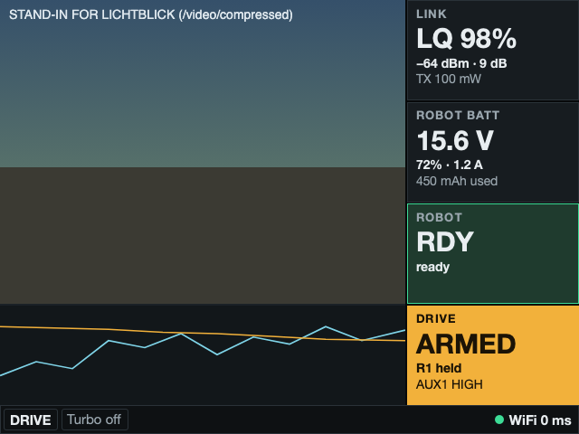

## Video

`video.source` in `/etc/rc/ui.json` picks the video: `webrtc` (native view, the robot's `webrtcsink` stream, no plots), `lichtblick` (WebEngine view with video and plots) or `none`. `auto` (default) is `webrtc` when the UI was built with it, else `lichtblick`.

The WebRTC view needs the gst-plugins-rs `webrtcsrc` plugin, which Ubuntu does not package: build it with `tools/webrtc_spike/build_plugins.sh` and install it in `/opt/kvn_remote_control/gst-rs/lib/gstreamer-1.0` (the path `rc-ui.service` sets). It connects to the robot's signalling server (`robot.host:8443`), retries with a backoff of 1 s to 15 s, and shows `CONNECTING VIDEO…` or `VIDEO RESTARTING` with the reason while it has no picture.

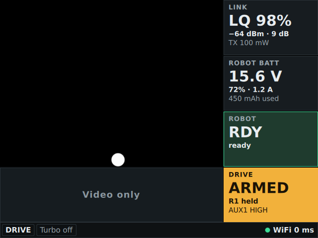

The picture above is the real UI on Qt 6.4 (Ubuntu noble) showing a `videotestsrc` stream from a fake robot.

## Navigation

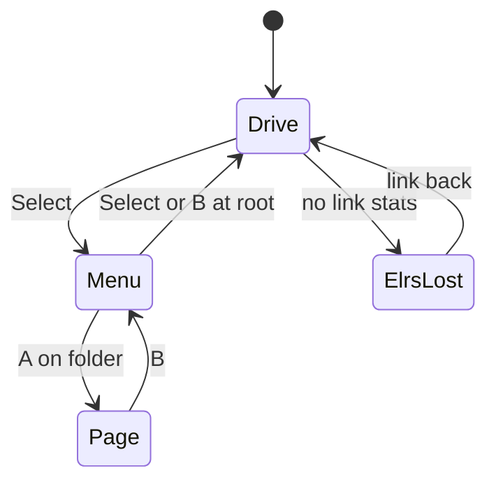

| Button | Drive | Menu |
|---|---|---|
| Select | open menu | close menu |
| L1 + R1 (hold 1 s) | arm | — |
| R1 | deadman (AUX1 high when armed) | — |
| R2 | turbo | — |
| D-pad up/down | — | move |
| D-pad left/right | — | change a value |
| A | — | open folder, apply value, run action |
| B | — | revert value, go back, close at root |

While the menu is open the sticks are forced neutral and the robot is not driven.

## Menu

Sections, top to bottom: **ELRS module** (the TX module's own parameters: packet rate, telemetry ratio, power, bind), **Input** (stick calibration), **System** (WiFi/VPN, robot bridge, theme, versions). Values with `‹ ›` are editable; a change is sent to the module only when you press A.

| ELRS parameters | System |
|---|---|
| 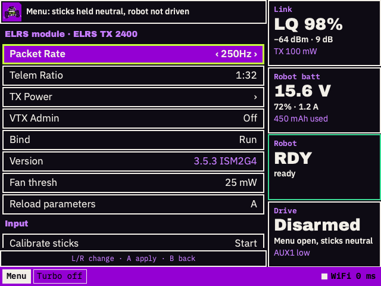 | 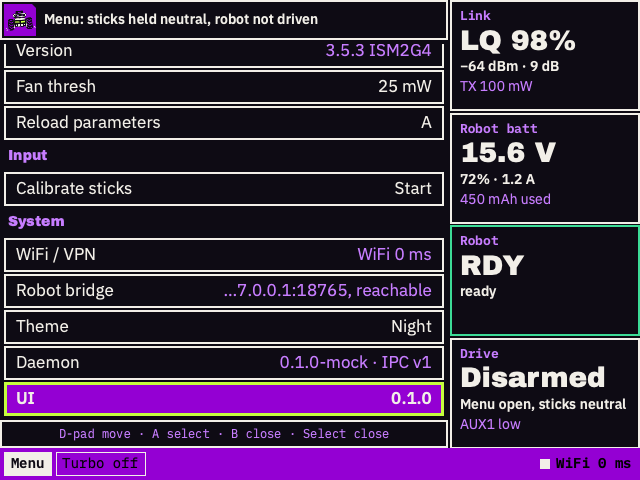 |

## Degraded states

| No WiFi | Poor ELRS link | ELRS link lost |
|---|---|---|
| 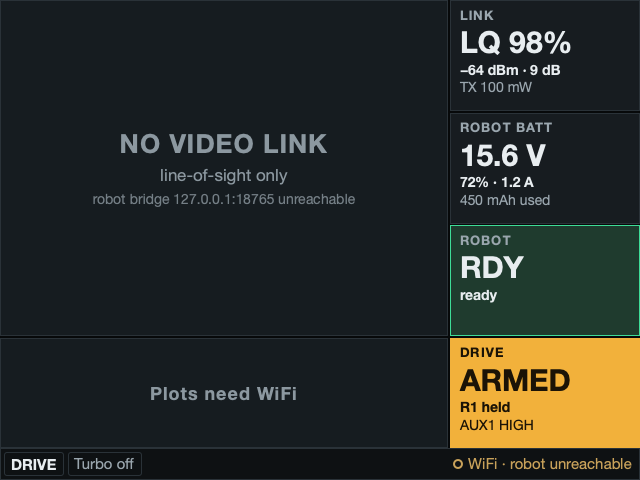 | 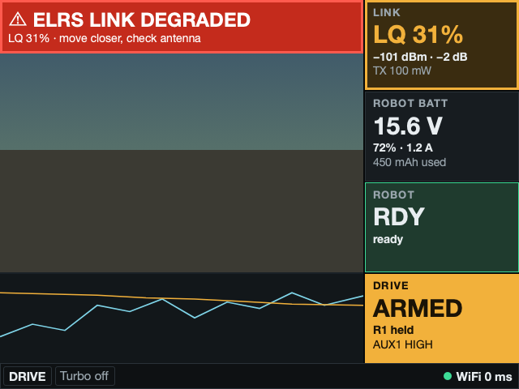 | 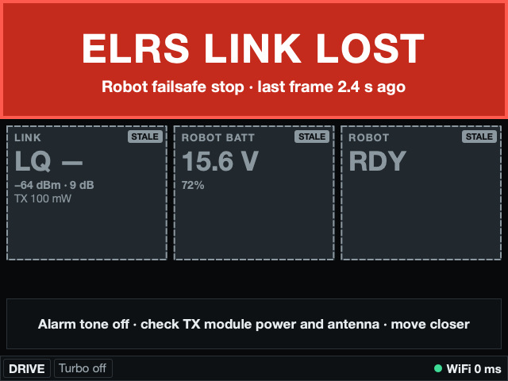 |
| Video and plots show placeholders; the right column is unchanged. | Banner at the top, Link tile turns amber. | Full-screen red alert and tone. Tiles are marked `STALE` and greyed. |

## Light theme

Switch it in the menu (System → Theme) for sunlight. Layout is identical.

| Drive | Menu | Link lost |
|---|---|---|
| 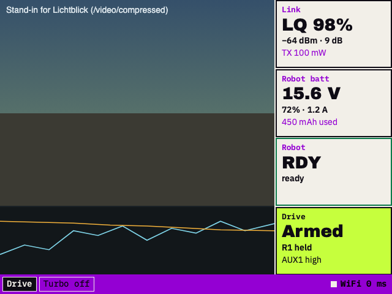 | 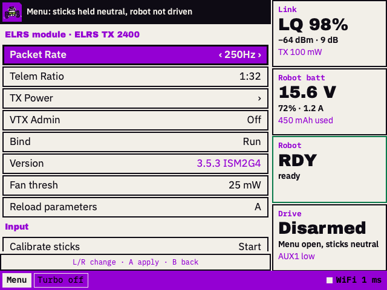 | 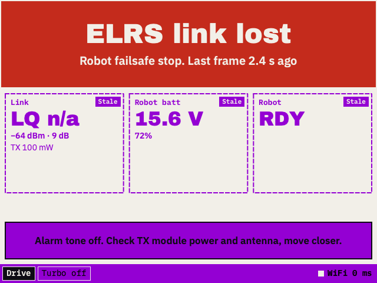 |

More variants in [screenshots/](screenshots/): `degraded_light`, `lq_degraded_light`, `menu_system_light`, and `live_daemon_*` (the real daemon driving the UI over IPC).
