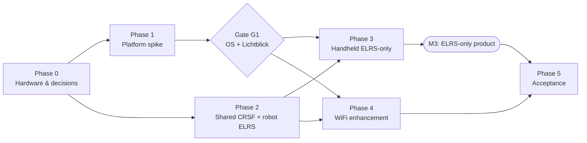

# Remote Controller: Development Plan

Implements [design.md](design.md). The order puts the riskiest assumptions first (handheld platform, Lichtblick feasibility). It then gets the ELRS-only system working end to end before any WiFi feature is added, because the ELRS-only system is already a complete product (design §1).

## How to Read This Plan

Every task has:

* **Depends on**: tasks that must be done first.
* **Deliverables**: concrete artifacts (files, packages, documents) that exist when the task is done.
* **Verify**: an objective check with a pass criterion. A task is done only when its check passes and the result is recorded.

Results (measurements, pass/fail, decisions) go in [docs/results.md](docs/results.md), in a section per task ID. A task with no recorded result is not done.

**Definition of done for the whole project:** every acceptance test in Phase 5 passes on the target hardware, including the full suite with WiFi disabled.

### Repository Layout (target)

The `kvn_*` packages below are in the [kvn-robot](https://github.com/AlessioMorale/kvn-robot) repository; everything else is in this repository (the CRSF library is the `deps/elrs_joy` submodule).

| Path | Contents |
|---|---|
| `crates/elrs_crsf_sys` | C++ facade and `cxx` bindings over `elrs_joy_crsf_protocol` |
| `crates/elrs_crsf` | Safe Rust CRSF API |
| `crates/control_daemon` | Handheld control daemon |
| `crates/test_tools` | Fake TX module (pty), virtual gamepad (`uinput`) |
| `ui` | QML UI and thin C++ host (CMake) |
| `lichtblick` | Pinned Lichtblick build script and fixed layout |
| `image` | OS image build (Armbian `userpatches` fork) or provisioning script (dArkOS) |
| `systemd` | Handheld systemd units and udev rules |
| `docs` | `results.md`, `budgets.md`, `ipc.md`, `hardware.md` |
| `deps/elrs_joy/...` | CRSF library and `crsf_joy_node` changes (robot and shared) |
| `kvn_status` | Status node (new) |
| `kvn_video_streamer` | Video streamer (new) |
| `kvn_robot_bringup` | Launch and config changes |

### Dependency Overview

Phase 2 does not depend on the platform spike and can run in parallel with Phase 1.

### Milestones

| Milestone | Exit criterion |
|---|---|
| **M0** Hardware ready | T0.1–T0.7 verified |
| **M1** Platform chosen | Gate G1 decided and recorded |
| **M2** Shared code ready | T2.1–T2.4 verified; robot sends status over ELRS |
| **M3** ELRS-only product | T3.1–T3.10 verified; drive the robot with the handheld, WiFi off |
| **M4** WiFi enhancement | T4.1–T4.6 verified |
| **M5** Accepted | All Phase 5 tests pass |

---

## Phase 0: Hardware and Decisions

### T0.1 Fix the turbo-button mapping
* **Depends on**: none
* **Deliverables**: `teleop.yaml` with `enable_turbo_button` and the header comments consistent (AUX2 = `buttons[1]`). Remove the inconsistency note in design §5.1.
* **Verify**: On the robot, with the existing RC handset, AUX2 high gives turbo scaling on `/cmd_vel` (`ros2 topic echo /cmd_vel` shows a speed of 2.0 instead of 1.0 at full stick), and AUX4 has no effect.

### T0.2 Wire the TX module to the internal UART
* **Depends on**: none
* **Deliverables**:
  * `docs/hardware.md`: UART2 pad locations (photo), wiring diagram (Mermaid), TX module model and firmware version, power source.
  * The module's handset UART baud set to 921600.
* **Verify**:
  * Continuity check of TX→RX, RX→TX, and GND.
  * The module powers up and is visible in its own WiFi/web UI or LED status.
  * Supply voltage at the module stays within spec while transmitting at the maximum planned RF power (multimeter or scope; record the minimum voltage).

### T0.3 Choose the robot camera chain
* **Depends on**: none
* **Deliverables**: `docs/hardware.md` section listing camera, driver, native modes, and encoder (hardware or x264), with the reasoning.
* **Verify**: On the robot, a GStreamer or FFmpeg command line captures from the camera and produces an H.264 file at 640x480, 15 fps, with no B-frames and a 1 s GOP. `ffprobe` confirms the profile, `has_b_frames=0`, and the keyframe interval. Record the encoder's CPU usage.

### T0.4 Set acceptance budgets
* **Depends on**: none
* **Deliverables**: `docs/budgets.md`, with the proposed values below confirmed or changed:

  | Metric | Proposed budget |
  |---|---|
  | Input-to-UART latency (evdev event → CRSF frame written), p99 | ≤ 10 ms |
  | CRSF frame period jitter at the handheld UART, p99 | ≤ 0.5 ms |
  | Robot `/joy` → `/cmd_vel` period jitter with bridge and video at full load, p99 | ≤ 5 ms |
  | Robot stop after ELRS loss | ≤ `failsafe_timeout_ms` + 50 ms |
  | Video glass-to-glass latency, direct VPN path, median | ≤ 250 ms |
  | Handheld RAM used, with Lichtblick running | ≤ 700 MB |
  | Handheld boot to "ready to arm" | ≤ 30 s |
  | Daemon restart to link re-established | ≤ 2 s |
* **Verify**: The table is reviewed and signed off (name and date recorded in `docs/budgets.md`).

### T0.5 Identify board revision and panel
* **Depends on**: none
* **Deliverables**: `docs/hardware.md` entry with the board silkscreen (photo), panel ID, and support status in both OS candidates (design §9.1).
* **Verify**: The board and panel appear in at least one candidate's support list. If neither lists them, raise the issue before Phase 1.

### T0.6 Choose the WiFi dongle
* **Depends on**: none
* **Deliverables**: `docs/hardware.md` entry with the dongle model, chipset, and its in-kernel driver name for both candidate kernels.
* **Verify**: On a Linux PC, the dongle works with the in-tree driver (`lsusb`, `ip link`, joins the test access point).

### T0.7 Choose the screen layout
* **Depends on**: none
* **Deliverables**: Design §3.2.1 updated with the chosen option (A, B, or C) and the reason, and the other options moved under a "Rejected options" heading. Theme decided: dark, light, or switchable.
* **Verify**: The choice is recorded in `docs/results.md` with name and date. T3.8 builds against it.

---

## Phase 1: Platform Spike (go/no-go)

**Objective**: Prove the R36S can host the design, and choose the OS image. T1.2–T1.6 are run on **both** candidate images, and their results are recorded side by side in `docs/results.md`.

### T1.1 Build or flash both candidate images
* **Depends on**: T0.5
* **Deliverables**:
  * **Armbian**:
    * a fork of [R36S-Stuff/R36S-Armbian](https://github.com/R36S-Stuff/R36S-Armbian) under `remote_controller/image/armbian/`
    * a new `config-r36s-trixie-minimal.conf`
    * a built image
  * **dArkOS**: the R36S fork matching T0.5, flashed, with EmulationStation and gaming services disabled. The steps are recorded in `image/darkos/provision.sh`.
  * Both images: Qt 6 QML and WebEngine, GStreamer, and ZeroTier installed.
* **Verify** (per image):
  * Boots to a usable display on our panel.
  * `cat /etc/os-release` reports Debian 13.
  * `qmlscene --version` (or a Qt 6 binary) runs.
  * `modprobe tun` succeeds.
  * Idle RAM after boot is recorded (`free -m`).

### T1.2 Cross-compilation toolchain
* **Depends on**: T1.1
* **Deliverables**:
  * `remote_controller/image/sysroot.sh`, which creates an aarch64 trixie sysroot.
  * A `.cargo/config.toml` with the target linker and `CXX_aarch64_unknown_linux_gnu` settings.
  * A CMake toolchain file for the UI.
* **Verify**:
  * From a clean checkout, one command builds a hello-world QML app and a hello-world Rust binary that calls a C++20 function through `cxx`.
  * Both run on the device: the QML app is fullscreen at 640x480 on `eglfs`, and the Rust binary prints the C++ result.

### T1.3 Internal UART bring-up
* **Depends on**: T0.2, T1.1
* **Deliverables**:
  * Kernel command line and device tree changes that free UART2: no `console=`/`earlycon` on it, getty disabled, and on dArkOS `fiq-debugger` disabled.
  * A udev rule for the `/dev/elrs_tx` symlink, in `systemd/`.
* **Verify**:
  * `ls -l /dev/elrs_tx` resolves to UART2.
  * `stty -F /dev/elrs_tx 921600` succeeds.
  * A capture script (`test_tools`) reads valid CRSF frames from the TX module (CRC passes, including `LINK_STATISTICS` or `DEVICE_INFO` after a ping).
  * After 5 reboots with the module attached, the module is still working and its configuration is unchanged.

### T1.4 WiFi and ZeroTier
* **Depends on**: T0.6, T1.1
* **Deliverables**:
  * A ZeroTier network with static IPs for the robot and handheld, recorded in `docs/hardware.md`.
  * ZeroTier configuration on both devices.
* **Verify**:
  * The handheld pings the robot's ZeroTier IP.
  * `zerotier-cli peers` shows a `DIRECT` path on the local access point.
  * `iperf3` over the VPN sustains ≥ 3 Mbit/s; record the handheld CPU use.
  * With the access point's internet uplink unplugged, record whether the VPN comes up from cold boot.

### T1.5 Lichtblick on device
* **Depends on**: T1.1, T1.2, T1.4, T0.3
* **Deliverables**:
  * `lichtblick/build.sh`, which produces a pinned static Lichtblick build.
  * `lichtblick/layout.json`, with one video panel and one plot.
  * A minimal QML host that loads it in `WebEngineView`.
  * A test stream on the robot: the T0.3 file republished as `foxglove_msgs/CompressedVideo`.
* **Verify** (per image; record each number):
  * **GPU**: `chrome://gpu` shows hardware-accelerated compositing and WebGL, not SwiftShader or software rendering.
  * **Video**: H.264 plays. Record the decoded fps, which must be ≥ 14 fps at 640x480/15 fps.
  * **Resources**: RAM total ≤ the T0.4 budget; CPU %; time to first video frame; UI frame rate.
  * **Fallback, only if H.264 fails in QtWebEngine**: a GStreamer pipeline decodes the same stream with the hardware decoder (`v4l2slh264dec` on Armbian; MPP on dArkOS), at ≥ 14 fps.

### Gate G1: Platform Decision
* **Depends on**: T1.1–T1.5 on both images
* **Deliverables**: A decision entry in `docs/results.md`, and design §9.1 and §11 updated to "decided".
* **Rule**:
  1. Pick the image that passes T1.3 and T1.5 with GPU acceleration. If both pass, pick Armbian.
  2. If neither passes T1.5 on resources or GPU, drop Lichtblick. Phase 4 then uses a native video and telemetry view (T4.5 alternative), and the UI may move to Slint (design §3.2).
  3. If H.264 fails in QtWebEngine but the fallback passes, keep Lichtblick for plots only, and play video natively (T4.5 alternative).
* **Verify**: The decision is recorded, and the unused image is archived.

---

## Phase 2: Shared CRSF Code and Robot-Side ELRS

Independent of Phase 1; can run in parallel.

### T2.1 CRSF library: handset-role extensions
* **Depends on**: none
* **Deliverables**: Changes in `deps/elrs_joy/elrs_joy_crsf_protocol`:
  * `0xEA` accepted in `Packets::VALID_SYNC_BYTES`.
  * `OpenTxSyncPayload` and message, with a deserializer.
  * Parameter protocol messages checked against the ELRS Lua exchange, and extended if needed (chunked `PARAMETER_SETTINGS_ENTRY`).
  * Golden-frame fixtures in `test/fixtures/*.hex`, one per frame type used: RC channels to `0xEE`, link stats, battery, flight mode, OpenTX sync, ping, device info, parameter entry (single and chunked), read, and write. Recorded from real hardware where possible.
* **Verify**:
  * `colcon test --packages-select elrs_joy_crsf_protocol elrs_joy_crsf_node` passes.
  * The new tests decode every fixture and re-encode it byte-exact (where encoding applies).
  * The existing `crsf_joy_node` tests still pass, so the robot behavior is unchanged.

### T2.2 Rust bindings
* **Depends on**: T2.1
* **Deliverables**:
  * The `crates/elrs_crsf_sys` crate: the `crsf_ffi.hpp/.cpp` facade and a `build.rs` that compiles the library sources through `cxx-build`.
  * The `crates/elrs_crsf` crate: a safe API and frame enums.
  * A `cargo fuzz` target on `parser_feed`.
* **Verify**:
  * `cargo test` passes, including the same `test/fixtures/*.hex` files read through the bindings.
  * A 10-minute `cargo fuzz run` finds no crash.
  * Cross-compiled to aarch64 with the T1.2 toolchain (once available), the test binary runs on the device.

### T2.3 `crsf_joy_node` forwards robot status
* **Depends on**: T2.1
* **Deliverables**:
  * Parameters `telemetry_status_enabled` and `status_topic` (default `/robot_status`).
  * `FLIGHT_MODE` sent at about 2 Hz, truncated to 15 characters.
  * Tests in `test_crsf_joy_node.cpp`.
  * The `teleop.yaml` entry.
* **Verify**:
  * The unit test checks the serialized frame for a published string, including truncation.
  * On hardware, a stock EdgeTX handset shows the string as the flight mode, with `ros2 topic pub /robot_status std_msgs/String "data: RDY"` changing it within 1 s.

### T2.4 Status node
* **Depends on**: none
* **Deliverables**: The `kvn_status` package:
  * the node; the configurable input list with staleness timeouts in yaml
  * the pure reduction function with unit tests
  * a bringup launch entry
* **Verify**:
  * Unit tests cover: each severity; a FAULT beating a WARN; ties going to the oldest; a stale input → `FLT`; the 15-character limit.
  * On the robot, killing the hwmon diagnostic node makes `/robot_status` show `FLT:…` within its timeout plus 0.5 s (`ros2 topic echo`).
  * `ros2 topic hz /robot_status` reports about 2 Hz.

**M2 check**: With T2.3 and T2.4 running on the robot, a stock EdgeTX handset shows the live status string, and injecting a fault changes it.

---

## Phase 3: Handheld ELRS-Only System

**Objective**: A complete controller with no WiFi (design §7, "Degraded" mode). All daemon code is in Rust.

### T3.1 Test tools
* **Depends on**: T2.2
* **Deliverables**: The `crates/test_tools` crate:
  * **`fake_tx`**: a pty that answers ping and parameter requests, replays recorded telemetry, emits `OPENTX_SYNC`, and logs received frames.
  * **`virtual_pad`**: a `uinput` device with the R36S button and axis layout, scriptable from a file.
* **Verify**:
  * `fake_tx` answers a ping from `elrs_crsf`.
  * `evtest` sees every R36S control from `virtual_pad`.
  * Both run on a Linux desktop and in CI.

### T3.2 Daemon serial and TX loop
* **Depends on**: T2.2, T3.1
* **Deliverables**:
  * `control_daemon` serial layer: `/dev/elrs_tx` at a configurable baud rate.
  * A `SCHED_FIFO` TX thread with `mlockall`, which sends `RC_CHANNELS_PACKED` to `0xEE` and adjusts its period from `OPENTX_SYNC`.
* **Verify**:
  * Against `fake_tx`: the frame period follows the sync frames (test changes the sync rate; the period converges within 1 s).
  * On the device: a logic analyzer or scope on UART TX shows frame-period jitter within the T0.4 budget over 10 minutes. Record the histogram.

### T3.3 Input mapping
* **Depends on**: T3.1
* **Deliverables**:
  * evdev input with grab.
  * `config/mapping.toml` producing the design §5.1 channel contract (axes, calibration, deadzone, inversion).
* **Verify**:
  * With `virtual_pad` scripts, unit and integration tests check channel values for neutral, full deflection on each axis, and each AUX source.
  * On the device, a calibration run records each stick's range.
  * While the daemon holds the grab, `evtest` sees no events (the grab is exclusive).

### T3.4 Safety state machine
* **Depends on**: none
* **Deliverables**: A pure state-machine module (no I/O) implementing design §6 (startup, arm, deadman, disarm, menu-forces-neutral, override bounds and expiry), wired into the TX loop.
* **Verify**: Unit tests, at least one per rule:
  * starts disarmed; refuses to arm with sticks off-centre
  * AUX1 is high only while armed and R1 is held
  * menu open → axes neutral and AUX1 low
  * an override expires when not refreshed, and is cleared on disarm
  * losing the input device → disarmed

  Tests run in CI.

### T3.5 Telemetry model
* **Depends on**: T2.2
* **Deliverables**: Parsing of link stats, battery, and status into a timestamped model, with staleness thresholds in config.
* **Verify**: Against `fake_tx` replay:
  * the values match the recording;
  * stopping the replay marks each field stale after its threshold (± 100 ms);
  * an ELRS link-quality drop below the threshold raises the "ELRS degraded" alarm.

### T3.6 Module configuration
* **Depends on**: T2.2, T3.2
* **Deliverables**: Device discovery (ping/info), reading the parameter tree, and writing TX power, packet rate, and telemetry ratio.
* **Verify**:
  * Against the real TX module: the parameter tree read by the daemon matches what the ELRS Lua script or web UI shows.
  * Changing TX power through the daemon is reflected in the module's web UI and survives a power cycle.

### T3.7 IPC server
* **Depends on**: T3.4, T3.5, T3.6
* **Deliverables**:
  * `docs/ipc.md`, the message schema.
  * A Unix socket server in the daemon.
  * A CLI client (`ctl`) for testing.
* **Verify**:
  * `ctl watch` shows telemetry at 10 Hz.
  * `ctl param set …` works and is acknowledged.
  * A test proves that no IPC message can arm the robot or set AUX1.
  * Killing the client never affects the TX loop: the frame period is unchanged.

### T3.8 Native UI
* **Depends on**: T0.7, T1.2, T3.7, Gate G1
* **Deliverables**:
  * `remote_controller/ui`: a QML app with a thin C++ host (IPC client and telemetry model).
  * The screen layout chosen in T0.7, in both full and degraded mode (design §3.2.1).
  * The status bar (design §3.2) and alarms with sound.
  * The menu overlay (Select toggles; navigated with the D-pad, A, and B), with a module-settings screen.
  * The ELRS-lost alarm screen.
* **Verify**:
  * Screenshots of full mode, degraded mode, the menu, and the alarm on the device match the chosen wireframes in design §3.2.1. Store them in `docs/`.
  * Outdoor readability: in daylight, a second person reads every status-bar value correctly at arm's length.
  * On the device, every status-bar field updates from live data.
  * Every menu item can be reached and changed with the gamepad only.
  * Opening the menu forces neutral (seen in `fake_tx` or UART logs).
  * Pulling the TX module's power raises the loud ELRS alarm within 1 s.

### T3.9 Image provisioning and supervision
* **Depends on**: Gate G1, T3.2–T3.8
* **Deliverables**:
  * systemd units: the daemon (`Restart=always`, real-time allowed) and the UI; boot straight to the UI; no network dependencies.
  * The image build (Armbian `customize-image.sh`) or provisioning script (dArkOS), installing everything from a clean image, with versions pinned.
* **Verify**:
  * Flash a clean image and boot with no network attached: the UI shows "ready to arm" within the T0.4 budget.
  * `kill -9` the daemon: the link is restored within the budget, and the daemon is disarmed.
  * `kill -9` the UI: the UI restarts while the TX frames continue.

### T3.10 CI
* **Depends on**: T2.1, T2.2, T3.1–T3.7
* **Deliverables**: A CI workflow running:
  * the `colcon test` jobs for `elrs_joy` and `kvn_status`;
  * `cargo test` for the crates;
  * a 2-minute `cargo fuzz` run;
  * a desktop integration test (daemon + `fake_tx` + `virtual_pad`);
  * cross-builds for aarch64.
* **Verify**: The workflow is green on the main branch, and a deliberately broken fixture makes it fail.

**M3 check**: With WiFi disabled on both devices, the handheld boots, arms, drives the robot, shows link, battery, and status, and changes TX power. Record the result in `docs/results.md`.

---

## Phase 4: WiFi Enhancement (optional link)

### T4.1 Bridge hardening
* **Depends on**: none
* **Deliverables**: `kvn_foxglove_bridge.launch.py` with:
  * `capabilities` read-only
  * a `topic_whitelist` matching `lichtblick/layout.json`
  * `send_buffer_limit`
* **Verify**: A WebSocket test client (Foxglove SDK script in `test_tools`):
  * client publish to `/cmd_vel` is refused;
  * service calls and parameter get/set are refused;
  * a topic not on the whitelist is not advertised.

### T4.2 Video streamer
* **Depends on**: T0.3
* **Deliverables**: The `kvn_video_streamer` package:
  * the camera → scale → frame-rate reduction → H.264 → `foxglove_msgs/CompressedVideo` pipeline;
  * all stream settings as parameters;
  * encoding on demand (subscribers only);
  * a bringup launch entry.
* **Verify**:
  * A test confirms the stream properties: Annex B start codes, no B-frames, keyframe interval ≤ 1 s.
  * The stream plays in Lichtblick on a desktop.
  * With no subscribers, the node's CPU use is < 2 %.
  * After a reconnect, video resumes within one keyframe interval plus 0.5 s.

### T4.3 Robot CPU isolation
* **Depends on**: T4.1, T4.2
* **Deliverables**:
  * systemd `Nice=`/`CPUQuota=` for the bridge and video.
  * `ROS_AUTOMATIC_DISCOVERY_RANGE=LOCALHOST` in the robot environment.
* **Verify**:
  * With the bridge streaming and video at maximum settings, `/joy` → `/cmd_vel` jitter is within the T0.4 budget (measured from rosbag timestamps).
  * `ros2 node list` from a laptop on the VPN shows nothing.

### T4.4 VPN and firewall
* **Depends on**: T1.4
* **Deliverables**:
  * nftables rules on the robot (port 8765 accepted only on the ZeroTier interface).
  * systemd ordering (`zerotier-one` before the bridge).
  * Optionally, ZeroTier flow rules.
* **Verify**:
  * From the LAN (non-VPN) address, `nc -zv <robot-lan-ip> 8765` fails.
  * Over ZeroTier, `nc -zv <robot-zt-ip> 8765` succeeds.
  * The rules survive a reboot.

### T4.5 Lichtblick integration
* **Depends on**: Gate G1, T3.8, T4.1, T4.2
* **Deliverables**:
  * The UI hosts the local Lichtblick build with the fixed layout, and builds the URL from config.
  * The view is started only when the bridge is reachable.
  * A watchdog restarts it after a crash or hang.
  * A native "no video link" panel is shown otherwise.
  * **Alternative, if G1 rule 2 or 3 applies**: a native QML video view (GStreamer with the hardware decoder) fed by a minimal Foxglove WebSocket client.
* **Verify**:
  * Video and plots are visible on the handheld.
  * `kill -9` of the web engine process: the status bar and control are unaffected, and the view recovers within 10 s.
  * Robot unreachable: the "no video link" panel is shown, and no high CPU or RAM growth is seen over 10 minutes.

### T4.6 Link-health indicators
* **Depends on**: T3.8, T4.4
* **Deliverables**: The status bar shows WiFi/VPN state and the direct/relayed path, read from `zerotier-cli`, at quiet severity.
* **Verify**:
  * Turning the access point off changes the indicator within 5 s without any loud alarm.
  * Forcing a relayed path (block UDP between the peers) shows "relayed".

---

## Phase 5: Acceptance and Benchmarking

All tests run on the target hardware with the provisioned image (T3.9). Each test records date, versions, result, and evidence (logs, video, or captures) in `docs/results.md`.

### A1 Functional, WiFi off
**Pass criteria** (WiFi off on both devices): drive, arm, disarm, deadman, menu-forces-neutral, TX power change, and the battery, status, and link display all work.

### A2 Failure injection
| ID | Action | Pass criterion |
|---|---|---|
| A2.1 | WiFi off while driving | Control unaffected; quiet indicator only |
| A2.2 | TX module power cut, WiFi up | Robot stops within the T0.4 budget (rosbag); loud alarm ≤ 1 s |
| A2.3 | `kill -9 control_daemon` | Robot stops within the failsafe time; daemon back and disarmed within budget |
| A2.4 | `kill -9` UI or web engine | Control continues uninterrupted; UI or view recovers |
| A2.5 | Bridge stopped on robot | No change in `/cmd_vel` behavior |
| A2.6 | Diagnostic error injected, WiFi off | Handheld shows `FLT:…` over ELRS within 2 s |
| A2.7 | `kvn_status` node killed | Handheld marks the status stale within its threshold |
| A2.8 | WiFi dropped and restored while viewing | Video resumes within one keyframe interval plus 0.5 s |

### A3 Security
| ID | Check | Pass criterion |
|---|---|---|
| A3.1 | Port 8765 from a non-VPN interface | Unreachable |
| A3.2 | Client publish, services, and parameters through the bridge | All refused |
| A3.3 | IPC request to arm or set AUX1 | Rejected |

### A4 Benchmarks
Every metric in `docs/budgets.md` is measured, using these methods:

* **Input-to-UART latency**: daemon trace timestamps (evdev kernel timestamp → write completion).
* **CRSF frame period jitter**: logic analyzer on the UART TX line.
* **Robot control-loop jitter**: rosbag `/joy` and `/cmd_vel` timestamps under full bridge and video load.
* **Video glass-to-glass latency**: one phone video showing a millisecond clock filmed by the robot camera next to the handheld screen. Measured over a direct and a relayed path.
* **Handheld RAM, CPU, and boot time**: `free`, `top`, and `systemd-analyze`, with and without Lichtblick.
* **ELRS telemetry rates actually achieved**: battery and status rates from the daemon's telemetry log, against design §5.2.

**Pass criterion**: every metric is within budget, or has a recorded, signed-off exception.

### A5 Tuning
* **Deliverables**: The final values for video resolution, frame rate, and bitrate; ELRS packet rate and telemetry ratio; and bridge buffer limits. They are committed to config and recorded with the A4 numbers that justify them.
* **Verify**: A4 is re-run with the final values and passes.
